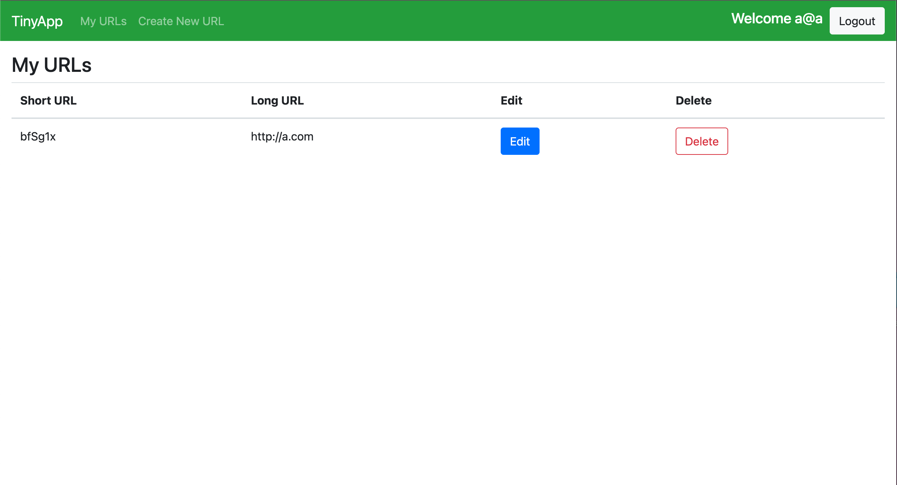
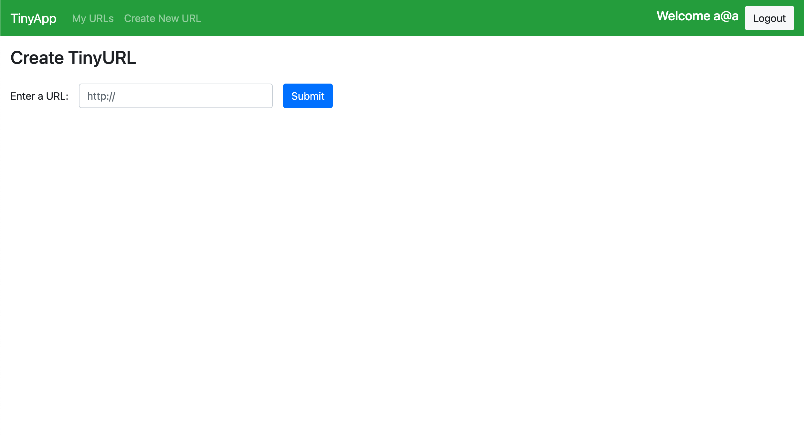
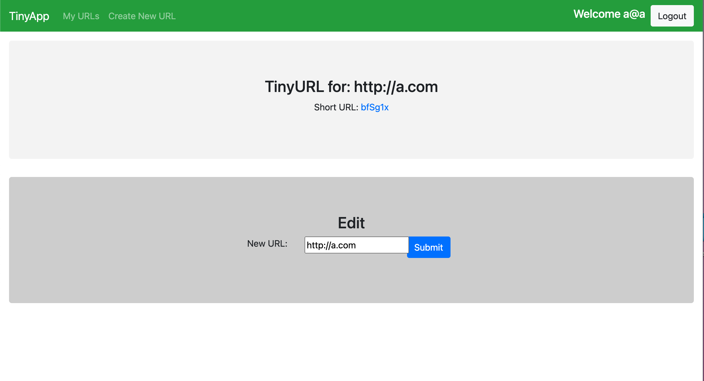

# TinyApp Project

TinyApp is a full stack web application built with Node and Express that allows users to shorten long URLs (à la bit.ly).

## Final Product

## Dependencies

- Node.js
- Express
- EJS
- bcrypt
- body-parser
- cookie-session

## Getting Started

- Install all dependencies (using the `npm install` command).
- Run the development web server using the `node express_server.js` command.

## Using TinyApp

- The first time you interact with TinyApp you will be asked to register with an email and a password
- After doing this, you will be redirected to the main dashbord to create your first TinyURL, to do this click on 'create tiny URL'
- In the new page type the URL you wish to tinyfy start with www....
- The next page will show you the TinyURL that is assigned to your URL, in this screen you can also edit the long URL in case there was a mistake
- To go back to the main dashboard click on "My URLs" in the navbar
- Enjoy!